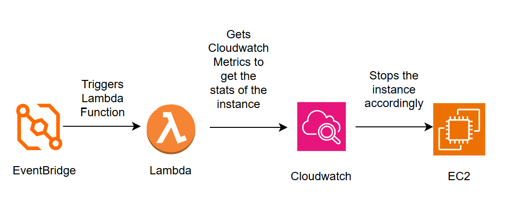

# 🖥️ EC2 Idle Instance Auto-Stop Lambda
 
A **serverless AWS automation** that identifies and stops idle EC2 instances using **CloudWatch Metrics**, **Lambda (Python)**, and **EventBridge scheduling** — reducing cloud costs while maintaining secure, least-privilege access.
 
---
 
## 🚀 Features
 
- Fetches CPU utilization metrics from **CloudWatch**
- Detects instances idle beyond a configurable duration
- Automatically stops idle EC2 instances using **boto3**
- Secured via a custom **IAM policy** with CloudWatch + EC2 permissions
- Handles metric delays with a “readiness check” before stopping
- Invoked periodically via **EventBridge rule (every 10 minutes)**
 
---
 
## 🧠 AWS Services Used
 
| Service | Purpose |
|----------|----------|
| **AWS Lambda (Python)** | Serverless execution logic |
| **CloudWatch Metrics** | CPUUtilization monitoring |
| **EventBridge** | Scheduled Lambda invocation |
| **IAM** | Role-based access and least privilege |
| **EC2** | Target instances for monitoring & stop |

 
---
 
## 📂 Project Files
 
| File | Description |
|------|--------------|
| `lambda_function.py` | Main Lambda handler to fetch metrics and stop idle EC2s |
| `iam_policy.json` | IAM policy granting CloudWatch + EC2 permissions |
| `eventbridge_schedule.json` | Sample rule definition for periodic scheduling |
| `/screenshots` | Visual proof (Lambda config, CloudWatch metrics, logs, etc.) |
 
---

## 💰 AWS Cost Comparison (Before vs After Automation)
 
| 🧩 Service | 💸 Before Automation (Monthly) | ⚙️ After Automation (Monthly) | 📉 Savings |
|:------------|:-------------------------------|:-------------------------------|:------------|
| **EC2 Instance (Compute)** | $35.00 | $7.00 – $17.00 | ✅ 50–80% |
| **EBS Storage (Root Volume)** | $3.00 | $3.00 | ⚙️ No change |
| **Data Transfer / Networking** | $1.50 | $0.50 | 🔻 Reduced usage |
| **CloudWatch Monitoring** | $0.30 | $0.30 | ⚙️ No change |
| **Lambda (Automation Function)** | – | $0.05 | 🪶 Negligible |
| **EventBridge Scheduler** | – | $0.01 | 🪶 Negligible |
| **Total (Approx.)** | **$40 / month** | **$8.86 – $20.36 / month** | **💵 50–80% savings** |
 
✅ **Result:**  
By using a Lambda + EventBridge setup to automatically stop idle EC2 instances, total monthly cost reduced from **≈ $40 → $9–20**,  
saving up to **$31/month (~$370/year)** without affecting performance.

## 🧩 IAM Policy (Sample)
 
```json
{
  "Version": "2012-10-17",
  "Statement": [
    {
      "Sid": "AllowCloudWatchMetricsRead",
      "Effect": "Allow",
      "Action": [
        "cloudwatch:GetMetricStatistics",
        "cloudwatch:ListMetrics",
        "cloudwatch:GetMetricData",
        "ec2:DescribeInstances",
        "ec2:StopInstances"
      ],
      "Resource": "*"
    }
  ]
}
 
