## Cloudformation Stack in primary region (us-east-1)
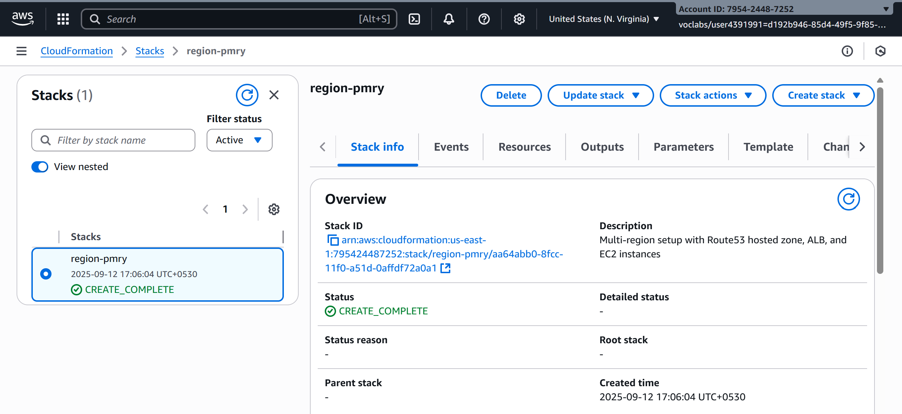

## Cloudformation Stack in secondary region (us-west-2)
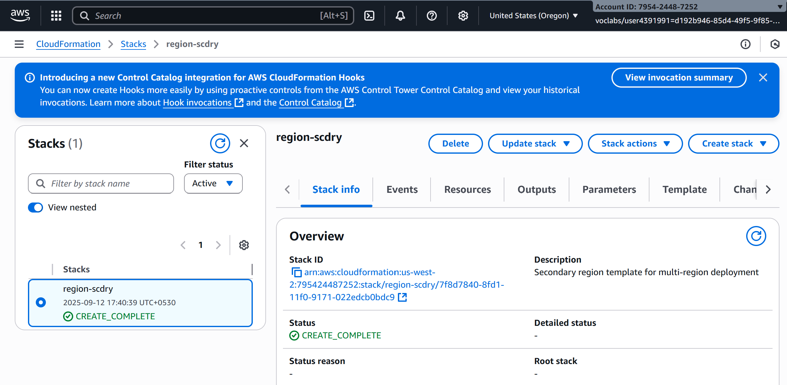

## Instances in primary region
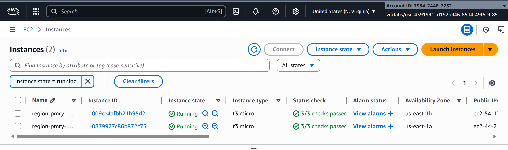

## Instances in secondary region
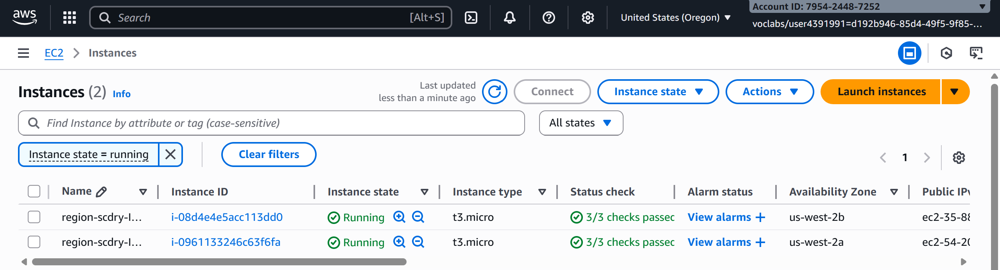

## Load balancer in primary region
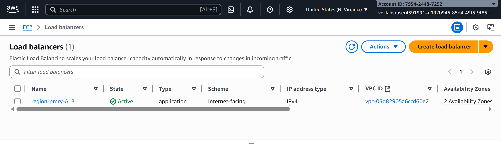

## Load balancer in secondary region
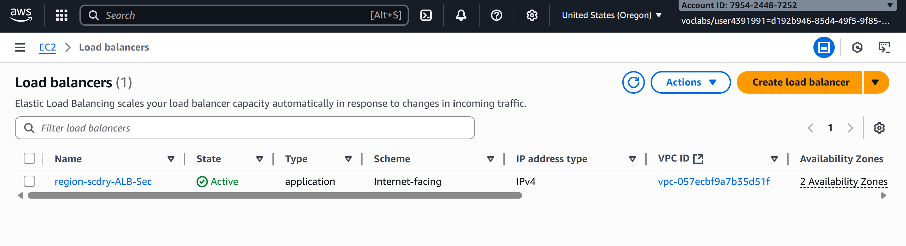

## Both Hosted Zones
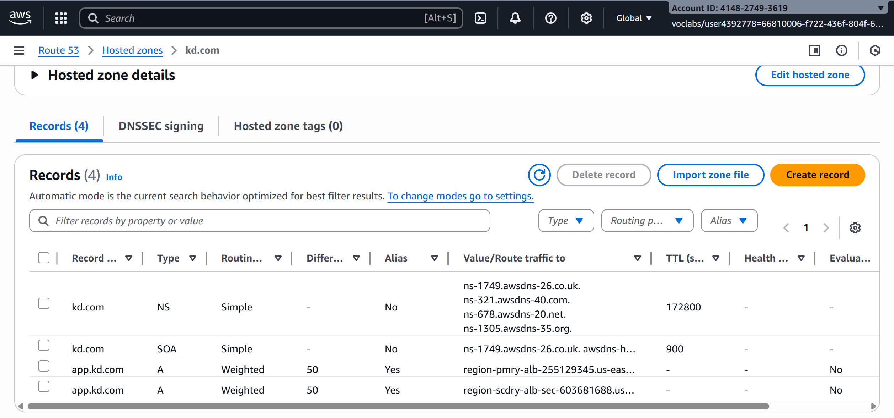

## ALB response in Primary Region Instance 2
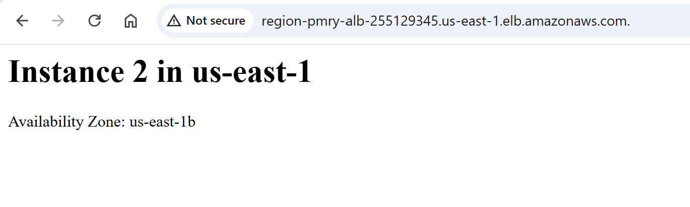

## ALB response in Primary Region Instance 1
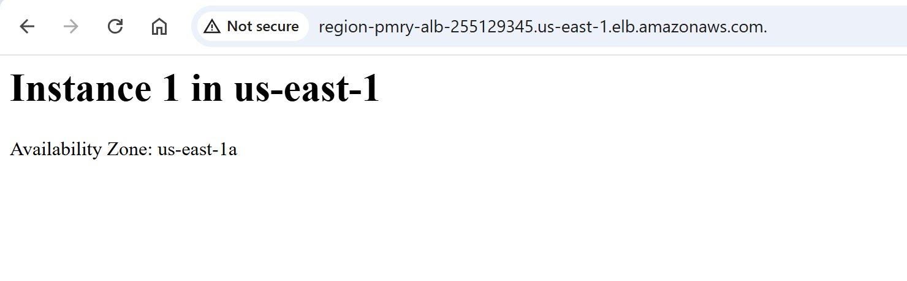

## ALB response in Secondary Region Instance 2
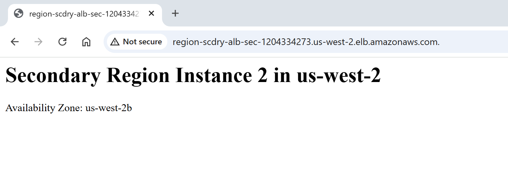

## ALB response in Secondary Region Instance 1
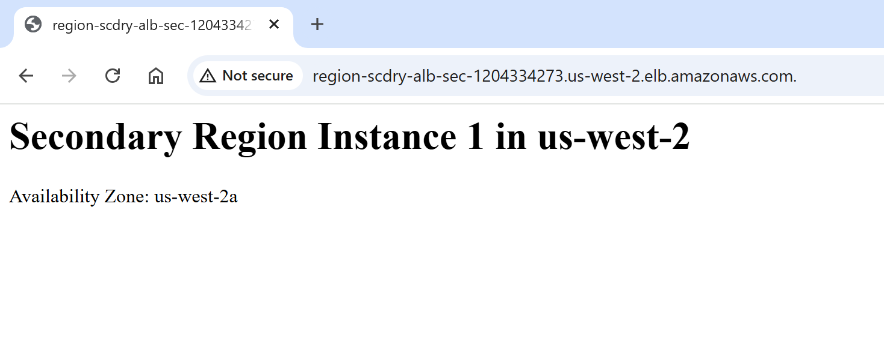
